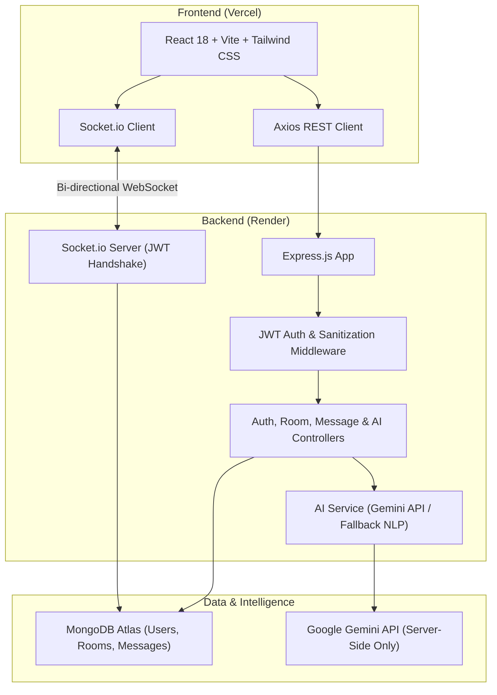

# ChatFlow AI — Production-Ready AI-Powered Real-Time Chat Platform

[](https://opensource.org/licenses/MIT)
[](https://nodejs.org/)
[](https://reactjs.org/)
[](https://socket.io/)
[](https://www.mongodb.com/cloud/atlas)
[](https://tailwindcss.com/)

**ChatFlow AI** is a production-grade, multi-user real-time chat application powered by **Socket.io WebSockets**, **React (Vite)**, **Node.js/Express**, **MongoDB Atlas**, and modular **AI services** (Google Gemini & fallback NLP).

Built with modern SaaS aesthetics, robust security (JWT + Bcrypt), multi-tab presence tracking, debounced typing indicators, and real-time AI tools (Assistant, Room Summaries, Smart Replies, Message Polish, Multi-Language Translation, and Semantic Search).

---

## 🏗️ System Architecture



---

## 🌟 Key Features

### ⚡ Real-Time Engine (Socket.io)
- **Bidirectional WebSocket Messaging**: Instant message transmission without polling.
- **Multi-Tab Presence Tracking**: Maintains sets of active socket IDs per user. A user stays online across multiple open tabs/devices and only goes offline when all connections terminate.
- **Dynamic Typing Indicators**: Shows debounced "User is typing..." or "Garv and Rahul are typing..." and clears automatically on send/timeout/disconnect.
- **Channel Rooms**: Join, leave, switch, and create custom discussion channels with live active online member counters.
- **Connection Recovery**: Automatic reconnect handling with visual connection badges (🟢 Connected, 🟡 Reconnecting, 🔴 Disconnected).

### 🤖 AI Capabilities (Server-Side Modular Layer)
- **🤖 AI Chat Assistant**: Dedicated conversational AI companion for code explanation, architecture advice, and debugging assistance.
- **✨ Discussion Summarizer**: Ingests recent room message history and outputs structured executive overviews, key topic tags, and action items.
- **💡 Smart Replies**: Generates 3 contextual quick responses above the message composer based on previous conversation threads.
- **✨ Message Improvement**: Refines drafts for grammar, tone, clarity, and phrasing with side-by-side Accept/Reject preview.
- **🌐 Multilingual Translation**: On-demand translation across English, Hindi, Hinglish, Spanish, French, and German.
- **🔍 Semantic Chat Search**: Intelligent natural language search over chat messages without requiring exact keyword matching.
- **😊 Sentiment Analysis & Moderation**: Analyzes message tone (Positive, Neutral, Negative) and screens for unsafe content.

### 🛡️ Authentication & Security
- **Bcrypt Password Hashing**: Salted passwords with 12 rounds.
- **JWT Authorization**: Signed tokens protecting API routes and Socket.io handshake authentication.
- **Zero-Exposed Secrets**: AI API keys and database credentials reside strictly on the Express backend.
- **CORS & Rate Limiting**: Global rate limiters and dedicated AI request limiters to protect cloud quota and prevent spam.

---

## 📁 Complete Folder Structure

```
real-time-chat-application/
├── .gitignore
├── package.json
├── README.md
├── backend/
│   ├── src/
│   │   ├── config/
│   │   │   └── db.js                 # MongoDB connection & default room seeder
│   │   ├── controllers/
│   │   │   ├── authController.js     # Register, Login, Me, Profile update
│   │   │   ├── roomController.js     # Get rooms, Create, Join, Leave
│   │   │   ├── messageController.js  # Paginated message history & REST fallback
│   │   │   └── aiController.js       # Chat, Summarize, Smart-reply, Translate, etc.
│   │   ├── middleware/
│   │   │   ├── authMiddleware.js     # JWT Bearer validation & socket auth helper
│   │   │   ├── errorMiddleware.js    # Global error & 404 handler
│   │   │   └── validationMiddleware.js # Input sanitization & field validation
│   │   ├── models/
│   │   │   ├── User.js               # User schema with bcrypt hooks & methods
│   │   │   ├── Room.js               # Channel schema with member references
│   │   │   └── Message.js            # Message schema with compound indexes
│   │   ├── routes/
│   │   │   ├── authRoutes.js
│   │   │   ├── roomRoutes.js
│   │   │   ├── messageRoutes.js
│   │   │   └── aiRoutes.js
│   │   ├── services/
│   │   │   ├── aiService.js          # Multi-provider Gemini / Fallback AI engine
│   │   │   ├── summaryService.js     # Context-bounded room summarizer
│   │   │   └── moderationService.js  # Content safety checks
│   │   ├── socket/
│   │   │   └── socketHandler.js      # WebSocket events & multi-tab presence tracking
│   │   ├── utils/
│   │   │   ├── generateToken.js      # JWT signer
│   │   │   └── errorResponse.js      # Custom error wrapper
│   │   ├── app.js                    # Express app configuration & middlewares
│   │   └── server.js                 # Server entrypoint with Socket.io & HTTP server
│   ├── .env.example
│   ├── package.json
│   └── README.md
└── frontend/
    ├── src/
    │   ├── components/
    │   │   ├── ai/
    │   │   │   ├── AIChatAssistant.jsx
    │   │   │   ├── AISearchModal.jsx
    │   │   │   ├── AISummaryModal.jsx
    │   │   │   ├── ImproveMessageModal.jsx
    │   │   │   └── SmartReplies.jsx
    │   │   ├── chat/
    │   │   │   ├── ChatHeader.jsx
    │   │   │   ├── ConnectionStatus.jsx
    │   │   │   ├── MessageBubble.jsx
    │   │   │   ├── MessageInput.jsx
    │   │   │   ├── MessageList.jsx
    │   │   │   ├── NotificationToast.jsx
    │   │   │   └── TypingIndicator.jsx
    │   │   ├── common/
    │   │   │   ├── Avatar.jsx
    │   │   │   ├── Button.jsx
    │   │   │   ├── Input.jsx
    │   │   │   ├── Modal.jsx
    │   │   │   ├── ProtectedRoute.jsx
    │   │   │   └── Skeleton.jsx
    │   │   ├── rooms/
    │   │   │   ├── CreateRoomModal.jsx
    │   │   │   ├── RoomItem.jsx
    │   │   │   └── RoomList.jsx
    │   │   └── users/
    │   │       ├── OnlineUsers.jsx
    │   │       └── ProfileModal.jsx
    │   ├── context/
    │   │   ├── AuthContext.jsx
    │   │   └── SocketContext.jsx
    │   ├── hooks/
    │   │   ├── useAuth.js
    │   │   ├── useSocket.js
    │   │   └── useChat.js
    │   ├── layouts/
    │   │   └── DashboardLayout.jsx
    │   ├── pages/
    │   │   ├── Dashboard.jsx
    │   │   ├── Landing.jsx
    │   │   ├── Login.jsx
    │   │   └── Register.jsx
    │   ├── services/
    │   │   ├── aiService.js
    │   │   ├── api.js
    │   │   ├── authService.js
    │   │   ├── messageService.js
    │   │   └── roomService.js
    │   ├── socket/
    │   │   └── socket.js
    │   ├── utils/
    │   │   └── helpers.js
    │   ├── App.jsx
    │   ├── index.css
    │   └── main.jsx
    ├── .env.example
    ├── index.html
    ├── package.json
    ├── postcss.config.js
    ├── tailwind.config.js
    ├── vercel.json
    └── vite.config.js
```

---

## ⚙️ Environment Variables

### Backend (`backend/.env`)

```env
# Server
PORT=5000
NODE_ENV=development

# MongoDB Atlas Connection String
MONGODB_URI=mongodb+srv://<username>:<password>@cluster0.abcde.mongodb.net/chatflow?retryWrites=true&w=majority

# Security
JWT_SECRET=super_secret_jwt_key_chatflow_ai_2026_production_safe
JWT_EXPIRES_IN=7d

# CORS Allowed Origin
CLIENT_URL=http://localhost:5173

# AI Service (Google Gemini API)
AI_API_KEY=your_gemini_api_key_here
AI_MODEL=gemini-1.5-flash
AI_PROVIDER=gemini
```

### Frontend (`frontend/.env`)

```env
VITE_API_URL=http://localhost:5000/api
VITE_SOCKET_URL=http://localhost:5000
```

---

## 🚀 Local Development Guide

### Prerequisites
- [Node.js](https://nodejs.org/) (v18+)
- [MongoDB Community Server](https://www.mongodb.com/try/download/community) or a free [MongoDB Atlas Cluster](https://www.mongodb.com/cloud/atlas)

### 1. Clone the repository
```bash
git clone YOUR_GITHUB_REPOSITORY_URL
cd "real time chat application"
```

### 2. Setup and Run Backend
```bash
cd backend
npm install
# Configure backend/.env with your MONGODB_URI and AI_API_KEY
npm run dev
```
*Backend runs on `http://localhost:5000`.*

### 3. Setup and Run Frontend (in a second terminal)
```bash
cd frontend
npm install
npm run dev
```
*Frontend runs on `http://localhost:5173`.*

---

## 🗄️ MongoDB Atlas Setup Guide

1. Sign up for a free account at [MongoDB Atlas](https://www.mongodb.com/cloud/atlas).
2. Create a new Shared Cluster (**M0 Free Tier**).
3. Under **Security → Database Access**, create a new database user (e.g. `chatflow_admin` with a secure password).
4. Under **Security → Network Access**, add IP Address `0.0.0.0/0` (Allow Access from Anywhere) to allow Render and cloud connections.
5. In your cluster dashboard, click **Connect → Drivers (Node.js)**.
6. Copy the connection string:
   ```
   mongodb+srv://chatflow_admin:<password>@cluster0.xxxx.mongodb.net/chatflow?retryWrites=true&w=majority
   ```
7. Paste it into `backend/.env` as `MONGODB_URI`.

---

## ☁️ Deployment Guide

### Backend Deployment (Render)

1. Create an account on [Render](https://render.com/).
2. Click **New + → Web Service** and connect your GitHub repository.
3. Configure the service:
   - **Root Directory**: `backend`
   - **Environment**: `Node`
   - **Build Command**: `npm install`
   - **Start Command**: `npm start`
4. Add Environment Variables:
   - `PORT`: `5000` (or leave default, Render sets `PORT` automatically)
   - `NODE_ENV`: `production`
   - `MONGODB_URI`: `<Your MongoDB Atlas URI>`
   - `JWT_SECRET`: `<A long random secret string>`
   - `JWT_EXPIRES_IN`: `7d`
   - `CLIENT_URL`: `https://your-frontend.vercel.app`
   - `AI_API_KEY`: `<Your Gemini API Key>`
   - `AI_MODEL`: `gemini-1.5-flash`
   - `AI_PROVIDER`: `gemini`
5. Click **Deploy Web Service**.

### Frontend Deployment (Vercel)

1. Create an account on [Vercel](https://vercel.com/).
2. Click **Add New → Project** and import your GitHub repository.
3. Configure project settings:
   - **Framework Preset**: `Vite`
   - **Root Directory**: `frontend`
   - **Build Command**: `npm run build`
   - **Output Directory**: `dist`
4. Add Environment Variables:
   - `VITE_API_URL`: `https://your-backend-render-app.onrender.com/api`
   - `VITE_SOCKET_URL`: `https://your-backend-render-app.onrender.com`
5. Click **Deploy**.

---

## 🎯 10 Project-Specific Technical Interview Q&A

### 1. Why did you use Socket.io instead of HTTP short or long polling?
**Answer**: Short polling creates excessive HTTP overhead, header serialization latency, and server load because clients continually poll regardless of whether new messages exist. Long polling keeps connections hanging but still requires connection re-establishment per message. **Socket.io** provides a persistent, full-duplex TCP WebSocket connection with near-zero latency, minimal packet headers, and automatic fallback to HTTP long-polling only when WebSocket handshakes are blocked by enterprise proxies.

### 2. How does real-time message delivery work in your architecture?
**Answer**: 
1. The client invokes `socket.emit('sendMessage', { roomId, content })`.
2. The server's Socket.io middleware validates the JWT attached to the handshake.
3. The message controller validates content length and trims inputs.
4. The message is persisted to MongoDB with `Message.create()`.
5. Mongoose populates sender metadata (`name`, `username`, `avatar`).
6. The server broadcasts the populated message to the specific room subscribers via `io.to(roomId).emit('receiveMessage', message)`.
7. Subscribed clients update their local React state without page reloads.

### 3. How did you implement multi-tab / multi-device online presence?
**Answer**: Instead of storing a boolean flag per user, the backend maintains a `userSockets = new Map<userId, Set<socketId>>()`. When a socket connects, its `socketId` is added to that user's `Set`. If the set size was `0`, the user is marked `online` in the database and a `userOnline` event is broadcast. When a socket disconnects, only that `socketId` is removed. The user is only marked `offline` and broadcast via `userOffline` when their `Set` becomes empty, preventing accidental offline status when closing just one of several open tabs.

### 4. How does JWT authentication work with WebSockets?
**Answer**: During client initialization, the JWT is passed via the handshake auth object: `io(SOCKET_URL, { auth: { token } })`. On the server, a Socket.io middleware (`io.use(async (socket, next) => ...)`) intercepts the connection before the WebSocket upgrade completes, verifies the token using `jwt.verify()`, queries the user model, and attaches the sanitized user instance directly to `socket.user`. Any unauthorized attempt or expired token immediately aborts the connection.

### 5. How are messages persisted and paginated efficiently in MongoDB?
**Answer**: The `Message` schema incorporates a compound index `{ room: 1, createdAt: -1 }`. When entering a channel, the client fetches the 50 most recent messages using `Message.find({ room: roomId }).sort({ createdAt: -1 }).limit(50)`. Older messages are loaded via cursor pagination using the timestamp of the oldest rendered message (`{ createdAt: { $lt: oldestMessageTimestamp } }`), avoiding slow `$skip` offsets.

### 6. How did you implement real-time typing indicators without flooding the network?
**Answer**: On the frontend, keyboard input triggers `emitTyping(roomId)` throttled with a 2-second debounce timer that automatically emits `stopTyping(roomId)`. On the backend, a `roomTypingMap` tracks typing users per room and broadcasts the list to other clients via `socket.to(roomId).emit('typingUpdate', { typingUsers })`. Typing states are also cleared whenever the user sends a message or disconnects.

### 7. How did you secure the AI API key and prevent exposure?
**Answer**: The AI API key is strictly stored in backend environment variables (`AI_API_KEY`). The React client never contacts AI endpoints directly; it makes authenticated REST calls to Express controllers (`/api/ai/*`). The Express server validates the JWT, checks rate limits, processes the prompt, queries the Gemini REST API on the server side, and returns sanitized results to the client.

### 8. How did you optimize AI token usage and latency?
**Answer**: 
1. **Context Window Bounding**: For room summaries, only the latest 30 messages are sent rather than the entire history.
2. **Smart Replies**: Context is limited to the last 5 messages.
3. **Caching**: Translated messages and sentiment labels are cached directly on the `Message` document in MongoDB to avoid redundant AI queries.
4. **Selective Heuristic Fallbacks**: Fast NLP heuristic fallbacks are used if API keys or quotas are temporarily unavailable.

### 9. How does Socket reconnection work without losing state?
**Answer**: The Socket.io client is configured with exponential backoff (`reconnectionAttempts: 10`, `reconnectionDelay: 1000`, `reconnectionDelayMax: 5000`). When connection drops, UI displays a reconnecting state. On the `reconnect` event, the client re-emits `joinRoom` for the active room ID and pulls any missed messages using the latest timestamp cursor.

### 10. How would you scale this application to 100,000 concurrent users?
**Answer**:
1. **Horizontal Scaling with Redis Adapter**: Run multiple Node.js instances behind an Nginx or AWS ALB load balancer with sticky sessions, using `@socket.io/redis-adapter` for pub/sub event distribution across server nodes.
2. **Database Sharding & Read Replicas**: Shard MongoDB messages by `roomId` with read-replicas for historical message queries.
3. **Message Queue for AI & Analytics**: Offload heavy AI summarization and moderation jobs to an asynchronous BullMQ / RabbitMQ worker queue.
4. **CDN Caching**: Distribute static frontend assets via Cloudflare/Vercel Edge CDN.

---

## 💼 Resume-Ready Project Description

> **ChatFlow AI — AI-Powered Real-Time Chat Platform**
> *Tech Stack: React.js, Vite, Node.js, Express.js, Socket.io, MongoDB Atlas, Tailwind CSS, Google Gemini AI, JWT*
> - Engineered a full-stack real-time collaboration platform featuring bidirectional WebSocket messaging, multi-tab presence tracking, and debounced typing indicators.
> - Implemented secure authentication with salted Bcrypt password hashing, JWT authorization middleware, and protected Socket.io connection handshakes.
> - Architected a backend AI service integrating Google Gemini for automated room summarization, smart replies, message polishing, multilingual translation, and semantic search.
> - Designed an optimized MongoDB schema with compound indexing `{ room: 1, createdAt: -1 }` enabling sub-50ms paginated message retrieval.
> - Deployed production infrastructure on Vercel (Frontend) and Render (Backend) with MongoDB Atlas cloud clustering and responsive mobile drawer UI.

---

## 📜 Git Version Control Commands

```bash
# Initialize and commit
git init
git add .
git commit -m "Initial commit: Complete production-ready ChatFlow AI application"
git branch -M main

# Link to your remote GitHub repository and push
git remote add origin YOUR_GITHUB_REPOSITORY_URL
git push -u origin main
```

---

## 📄 License

This project is licensed under the [MIT License](LICENSE).
